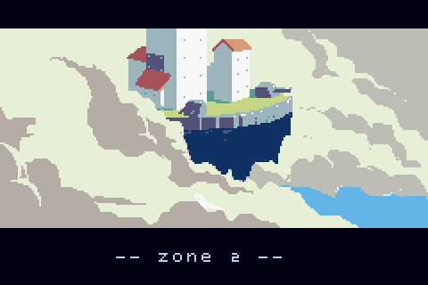
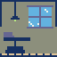
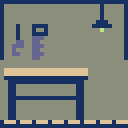
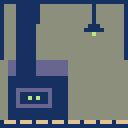

# Skyland


## Overview



A Gameboy Advance game created, frantically, for a game jam, in about twenty
days. A simple realtime strategy game where you build flying castles and fight
AI players. Also includes a multiplayer vs mode.

NOTE: This page sort of just includes a conceptual demo of SKYLAND. I'm working on the
full version in a private repository, and will release it sometime in the future.

For the latest version, check out the <a href="https://skylandgame.io/">game's website</a>.

I forked a top-down action game called Blind Jump to leverage some existing gba
framework code that I'd written in the past for interfacing with the hardware,
but most of the code is entirely new. For game-specific code, see the source/skyland 
directory, and the scripts directory, where you'll find all the various level scenarios
as LISP code.


## Controls, Mechanics, and other Info

Skyland has nuanced controls and mechanics, which I will describe below. Additionally,
If you scroll all the way to the right on the title screen, one of the plugin modules
on the Extras screen provides a series of video tutorials.


### Islands

All of the action in the game takes place on flying castles. At most two islands
comprise each level, where the player controls one island, and an AI controls
the other island. Hostile fortresses will attack the player, while neutral or
peaceful islands may give the player coins, items, or blocks.


### Rooms

Each Island consists of a layer of terrain, atop of which the player can build
structures. The game generalizes all structures as rooms, although not all rooms
can be occupied (players cannot move characters into solid rooms, like cannons
or walls, for instance).

To build new rooms, open up the construction menu by pressing the right
bumper. You may then press A to select a construction site, and then scroll
through a list of structures to build with the d-pad. Press A again to
construct the selected room. The game may reject your request to build
structures, if you have not collected enough coins, or have not constructed
enough power cores to sustain the new addition.

You may also salvage and recover some value from existing rooms, by selecting
the room with the cursor, and pressing B.

You may pause the game to make adjustments at any time, by pressing the left
bumper. Pausing frequently does affect your highscore a bit though.

Press the select button to toggle the interior view of your castle.

See below for a complete annotation of all structures that you may build:

---

#### Hull


The simplest block in the game. A purely defensive structure. The only structure
in the game that does not supply or deplete energy.

---

#### Cannon


For attacking other islands. Mainly used for attacking horizontally. Select a 
cannon and press A to choose a target. By default, the selector will move between
targets sequentially (left to right, top to bottom), but you can tap the R bumper
while choosing a target to detach and move the selector without constraint.

---

#### Missile Silo


For attacking other islands. Missiles will launch vertically, and fall down
vertically on the other island. For attacking the top face of an island.

---

#### Stairwell


A tall room, with no function other than to allow your fortress' residents to
move between blocks stacked on top of one another.

---

#### Infirmary



Heals each idle occupant _controlled by the owner of the infirmary._
Your characters will not heal while fighting an enemy. The health
provided by the infrirmary will be distributed evenly across all occupants, so a
player will heal more quickly if other characters are not attempting to heal at
the same time.

---

### Bulkhead


Select a bulkhead and press A to open/close. Four second recharge when the
bulkhead changes state. Characters cannot walk through closed bulkhead
doors. Use to limit invading enemy movement within your castle.

---

#### Workshop



A square room. Slightly lowers the cost of building all rooms, and allows you to
build the more complex structures listed below.

---

#### Power Core



Your island will include one power core at the beginning of the game. If all of a
castle's power cores are destroyed, it will sink into the clouds, and all of the
island's residents will perish. You must have a workshop in your castle to build
aadditional Power Cores. Each room on your island consumes an amount of power (with the
sole exception of hull blocks, which consume no power). If the total power
consumption of your island exceeds the combined power output of your power
cores, all systems will shut down, until you salvage rooms to free up power, or
until you build more power cores.

---

#### Forcefield


Almost identical to a Hull block, but consumes power, and your own weapons may
shoot through forcefield blocks without damaging them. Mainly intended for
protecting weapons (otherwise, you could just build Hull blocks). You must have
a workshop to build a Forcefield.

---

#### Transporter


Allows you to transport one of your characters to another island. Move one of
your characters into the transporter, select the transporter, and press the
A button. Your character will be transported to a
random room in the opponent's island. Transporters have a cool-down period, so
you may need to build multiple transporters if you want to effectively raid
enemy islands. By selecting an empty transporter, you may also retrieve
characters on other islands. A light on the transporter tile image will change
from red to blue when the transporter finishes recharging.

---

#### Radar


Allows you to see the interior of your opponent's structures. Fragile, and
consumes a relatively large amount of power. You must have a workshop to build a
Radar.

---

#### Ion Cannon


An energy weapon. Fires projectiles that pass through hull and rooms, and
cause bulkhead doors to open. Deals significant damage to forcefields.

---

#### Flak Gun


Fires projectiles that deal small amounts of damage to large areas of a
castle. Deals twenty damage at the point of impact, twelve damage to grid
locations adjacent to the point of impact, and ten damage to grid locations
one-tile-removed from the impact site.

```
         10
      10 12 10
   10 12 20 12 10
      10 12 10
         10

```

Rooms larger than one 16x16 tile will receive damage from each tile that
overlaps with the blast radius.

---

#### Replicator


Produces replicants. Move one of your human characters into the replicator, select
the replicator, and press A; the game will be give you the option to create a
replicant. Replicants cannot heal in an infirmary, and have 75% of the health of
the template character from which they were created.

---

### Characters

Characters, such as your castle's residents, or enemy goblins, can damage or
repair rooms. When successfully destroying another castle's room, a character
will plunder a fraction of the room's construction cost, increasing your coin
count.


## Downloads

See here: https://github.com/evanbowman/skyland/releases


## Building

1) Install all of the standard devkitpro libgba stuff.
2) Install cmake
3) `cd build && ./set-gameboy-advance-toolchain.sh` (a shortcut for running cmake with the correct toolchain file)
4) run `make`
5) run `./bundle.sh`. The bundle script creates Skyland.gba by appending the game's scripts and resources to the compiled engine ROM.

## Skyland LISP

The Skyland symbolic expression evaluator generally uses the same syntax as described [here](https://github.com/evanbowman/blind-jump-portable#lisp). A Scheme inspired functional programming language, with CommonLisp-styled macros, and some general gba-related weirdness thrown in.
