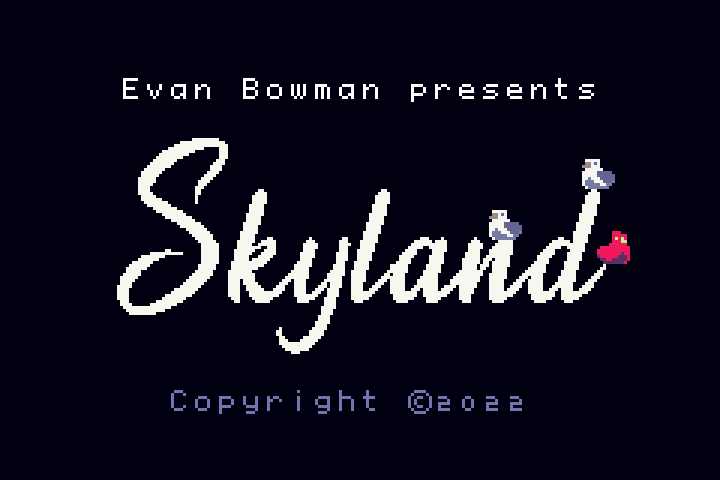
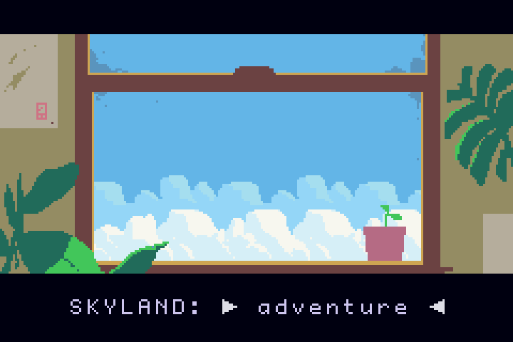
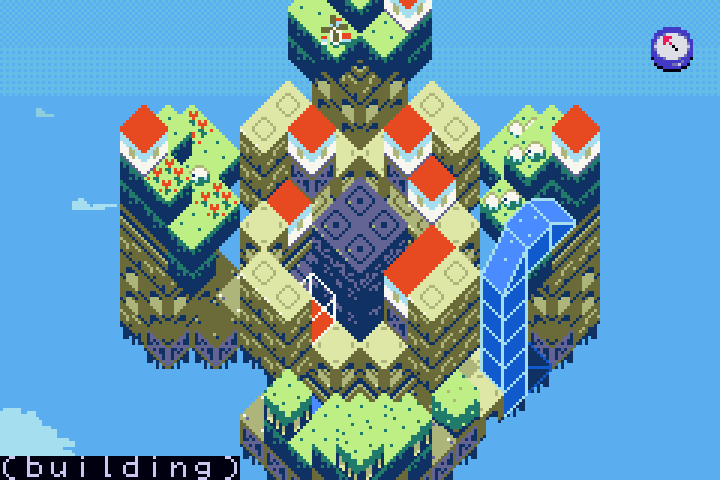

  

  

# SKYLAND

A realtime strategy game for Gameboy Advance. [watch the trailer!](https://www.youtube.com/watch?v=ih5aFE132jM)

  

  

# Overview

## Introduction

A detailed RTS game for GBA, inspired by FTL. Created in a couple of weeks for a game jam, and then improved over the course of a few years.

## Features

Skyland is jam-packed with stuff, some of the highlights:
* Roguelike Adventure mode, some similarities to FTL
* Isometric 3d island building macrocosm mode, with freebuild creative mode
* VS multiplayer and Co-op multiplayer modes
* Skyland Forever, a procedurally generated endless arcade mode
* Share macrocosm islands and adventure mode highscores on skylandgame.io by scanning QR codes
* An integrated lisp interpreter
* Uart serial console, serves a shell or a lisp repl over the link cable port in developer mode
* Builtin filesystem and text editor, as well as onscreen lisp repl, available in developer mode
* A checkers AI
* A robust event-driven game engine with support for fast-forwarding and even rewinding gameplay
* Scriptable button combos in lisp, similar to emacs keybindings
* A builtin Unicode engine, with support for English, Spanish, French, Italian, Russian, and over 2000 Chinese words
* A scriptable tutorial system
* Support for saving on several types of bootleg flashcarts
* Builtin glossary system
* Extensive help documentation for the scripting API

## Building

1) Install all of the standard devkitpro libgba stuff.
2) Make sure you have python3 and the PIP image library
3) Install cmake
4) `cd build && ./set-gameboy-advance-toolchain.sh` (a shortcut for running cmake with the correct toolchain file)
5) run ./build.sh

## Releases
[See here](https://github.com/evanbowman/skyland-beta/releases). Why so many releases? I like to have build artifacts in case something breaks. The program takes a few minutes to compile, so it's nice to have old builds when tracking down issues.

# Modding (no C++ toolchain required!)

I designed the Skyland to be moddable, and wrote all level scenarios in a custom scripting language called Skyland LISP. The script in tools/unpack_rom.py extracts the game's filesystem from the Skyland.gba ROM, producing a SkylandEngine.gba ROM and directories full of lisp scripts. After editing the scripts, simply run [repack.sh](https://github.com/evanbowman/skyland-beta/blob/master/repack.sh) from the same directory where you ran unpack_rom.py to zip everything back up into a Skyland.gba file!

# License

The software and source code are provided under the terms of the MPL2.0 license.
