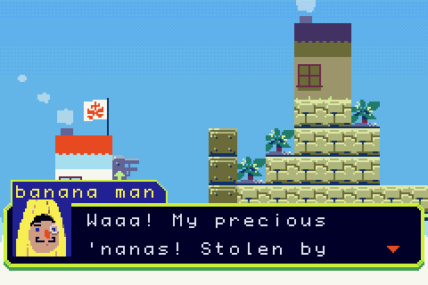

# SKYLAND

## Overview

The production version of SKYLAND for gameboy advance.

## Building

1) Install all of the standard devkitpro libgba stuff.
2) Install cmake
3) `cd build && ./set-gameboy-advance-toolchain.sh` (a shortcut for running cmake with the correct toolchain file)
4) run `make`
5) run `./bundle.sh`. The bundle script creates Skyland.gba by appending the game's scripts and resources to the compiled engine ROM.

## License

GPL-2. Actually, I'm generally pretty skeptical of GPL, and I usually prefer more permissive licenses. The FSF has always struck me as somewhat dogmatic and cult-like. But I spent a thousands of hours on this project, and I don't feel that other people should be able to take the source code without giving their contributions back. If you would like any of the library classes or any particular code snippets licensed under MIT or something else, I would be more than happy to give you specific portions of the code under a different license, as long as you ask first.